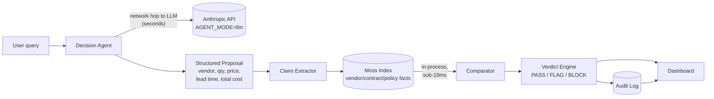

# Ops Decision Guardrail — Architecture

Companion to [PRD.md](./PRD.md). See the [live interactive diagram](https://claude.ai/artifact/HS7Qg6uUbQRvA4uMR5Ni1D) for the version with hover detail.

## The two paths

The core reliability story of this build is that there are two very different paths between a user's question and a number they might act on, and they have very different latency and trust profiles.

The Decision Agent's own generation step is the slow, untrusted part — a network round trip to an LLM (or, in `AGENT_MODE=scripted`, an instant but equally untrusted canned proposal used for demo determinism). Nothing downstream trusts that step's output at face value. The Guardrail path that follows it — claim extraction, Moss lookup, comparison, verdict — runs in-process against an indexed corpus and is what stays under the sub-10ms-per-claim / ~50ms-end-to-end budget called out in the PRD's success metrics.

## Components

| Component | Role | Notes |
|---|---|---|
| Decision Agent | Proposes an ops decision (vendor, quantity, unit price, lead time, total cost, rationale) as structured JSON | `lib/agent.ts`. `AGENT_MODE=scripted` (default) replays six fixed scenarios, several with deliberately injected errors, for a deterministic demo; `AGENT_MODE=llm` calls a real Anthropic model instead |
| Moss Index | Indexed corpus of vendor contract terms, budget policy, and reorder-policy facts, queryable by exact metadata filter (vendor, field) or semantic search | `lib/moss.ts`. `MockMossStore` (default, no credentials needed) or `LiveMossStore` (real `@moss-dev/moss` SDK, gated on `MOSS_PROJECT_ID`/`MOSS_API_KEY`) behind one `MossStore` interface |
| Claim Extractor | Pulls each checkable factual claim out of the agent's proposal — vendor approval, unit price, MOQ, budget cap, lead time | `lib/guardrail.ts`, `extractClaims()` |
| Comparator | Issues one Moss query per claim and compares the claimed value to the retrieved fact within field-appropriate tolerance (exact match for lead time and approval, numeric tolerance for price/MOQ/budget) | `lib/guardrail.ts`, `compareNumeric()` |
| Verdict Engine | Rolls up per-claim results (grounded / flagged / unverifiable, with severity) into one verdict and a confidence score | `lib/guardrail.ts`, `rollUpVerdict()` / `scoreConfidence()` |
| Audit Log | In-memory ring buffer (last 200 records) of every query/proposal/verdict triple, with citations, for after-the-fact review | `lib/auditLog.ts`. Notes: in-process for the hackathon demo; a real deployment would back this with SQLite or another durable store |
| Dashboard | Single-page UI: query box, agent's raw proposal, claim-by-claim breakdown with citations, verdict, latency, and scrollable audit history | `app/page.tsx` |

## Why this shape

Every claim gets its own Moss query rather than one big semantic search over the whole proposal, because the thing being verified is a set of discrete facts (this vendor, this field, this value), not a fuzzy question — metadata-filtered exact lookup is both faster and more precise than similarity search for that job. The guardrail never edits or "improves" the agent's proposal; it only classifies and reports, so the audit trail always reflects what the agent actually said, with the guardrail's independent check sitting next to it rather than replacing it.

---

*This document summarizes the [live architecture artifact](https://claude.ai/artifact/HS7Qg6uUbQRvA4uMR5Ni1D), which has the full interactive diagram.*
